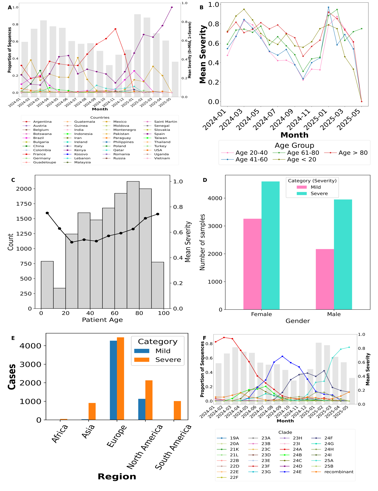
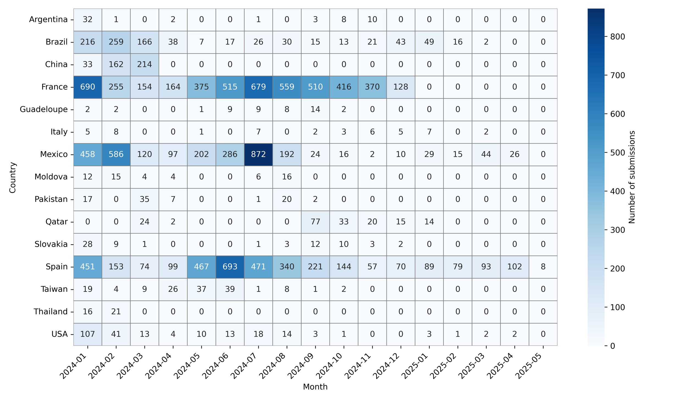
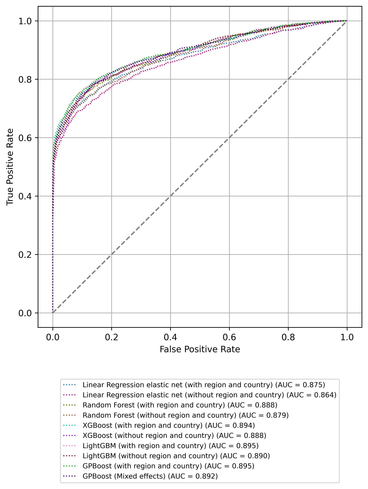
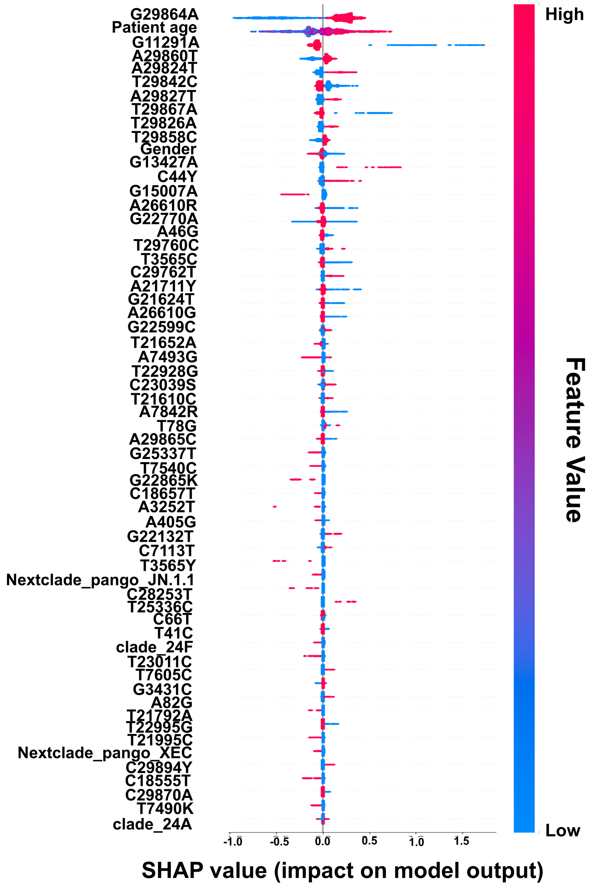
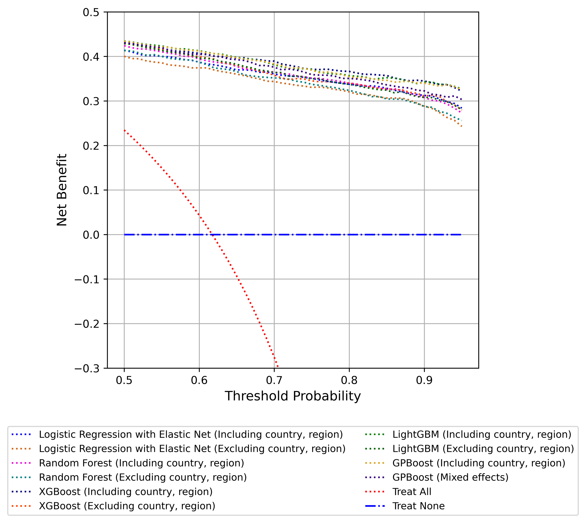
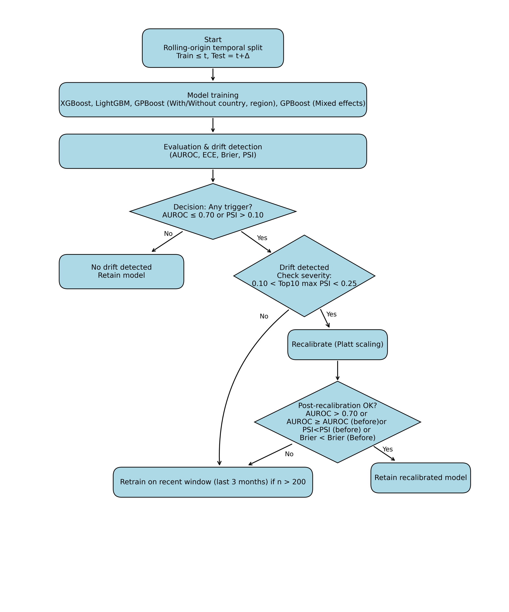
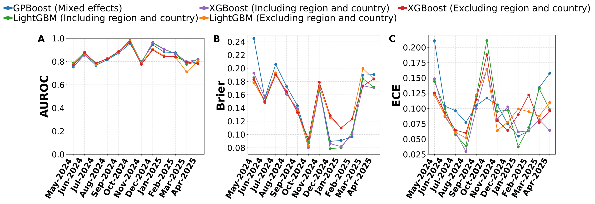

## Overview

This repository contains machine learning and genomic analysis workflows for predicting COVID-19 severity using recently circulating SARS-CoV-2 variants, nucleotide-level mutations, and patient metadata derived from GISAID.

The study integrates demographic variables, viral genomic mutations, lineage/clade information, and geographic metadata to construct interpretable severity prediction models using multiple machine learning algorithms, including Logistic Regession with Elastic Net, Random Forest, LightGBM, XGBoost, and GPBoost mixed-effects models.

The models were evaluated using statistical robustness analysis, temporal validation, leave-one-country-out cross-validation (LOOCV), and decision curve analysis to assess predictive performance and clinical utility of the best performing models.

SHAP (SHapley Additive exPlanations) was applied to identify important genomic and demographic predictors associated with severe COVID-19 outcomes. 

The repository also includes an extendable Python-based prototype pipeline capable of incorporating updated datasets and future clinical covariates for dynamic model updating and severity prediction.

## Machine Learning Models used

The following models were evaluated:

- Logistic Regression with Elastic Net Regularization 
- Random Forest
- XGBoost
- LightGBM
- GPBoost
- GPBoost (Mixed-effects)
Each if the models were tested under two scenarios i.e with and without country and region metadata except for GPBoost (Mixed effects) model where country and region have been included as random effect variables.

## Dataset

The study uses SARS-CoV-2 metadata and genomic sequences obtained from GISAID.

Due to GISAID data-sharing policies, raw sequence data are not redistributed in this repository.

## Important Figures

### Metadata Trends

Figure 1. Overview of SARS-CoV-2 metadata trends from January 2024 to May 2025, including temporal trends across countries, age groups, gender, regions, and circulating clades based on GISAID metadata. The figure also summarizes trends in mean COVID-19 severity across demographic categories.

### Country-wise Submission Trends

Figure 2. Heatmap showing month-wise SARS-CoV-2 sequence submission intensity for the top fifteen contributing countries in the dataset from January 2024 to May 2025. Darker colors indicate higher submission intensity.

### ROC Curve Analysis

Figure 3. Receiver Operating Characteristic (ROC) curves for the implemented models. Higher AUC values indicate better performance.

### SHAP Analysis

Figure 4. SHAP summary plot of the top 60 features ranked by importance in the prediction model. Positive SHAP values indicate increased contribution of the corresponding feature toward severe COVID-19 prediction, whereas negative values contribute toward mild COVID-19 prediction. Feature importance is ranked based on mean absolute SHAP values.

### Decision Curve Analysis

Figure 5. Decision Curve Analysis (DCA) comparing the clinical net benefit of the constructed machine learning models for predicting severe COVID-19 across multiple risk thresholds. Models with higher net benefit than both the “Treat All” and “Treat None” strategies are considered clinically useful.

Figure 6. Flowchart illustrating temporal validation framework with drift detection, recalibration and retraining.

Temporal validation plots showing AUROC, Brier Score, and Expected Calibration Error (ECE) across different time periods for XGBoost, LightGBM, and GPBoost models. Fluctuations in these metrics indicate model stability and potential performance drift over time.

## Author

Meghna Banerjee
